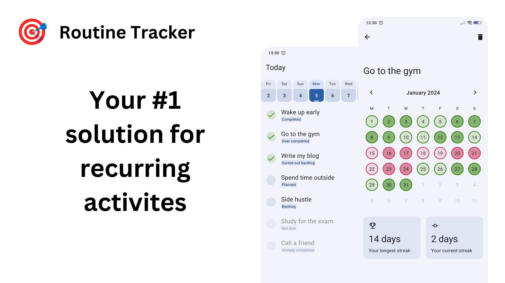
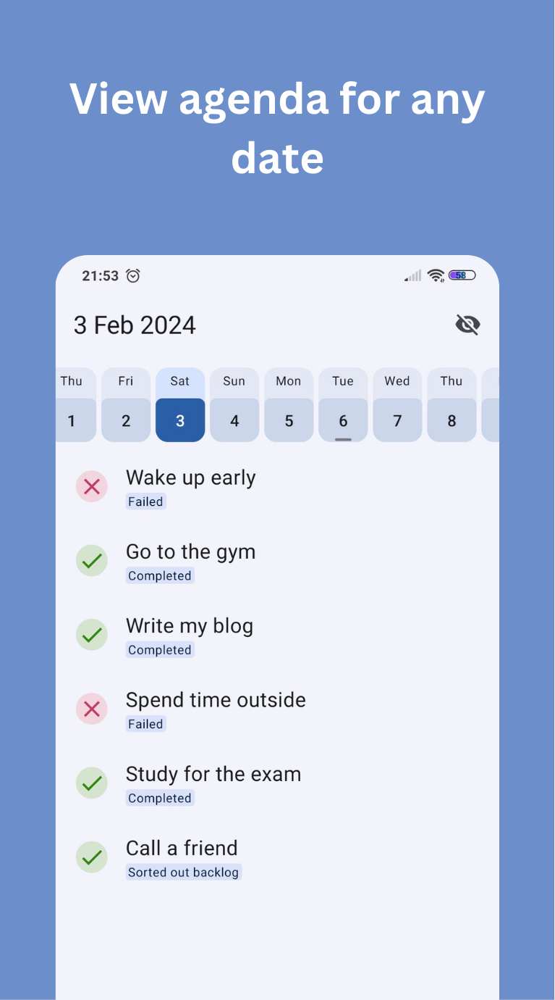
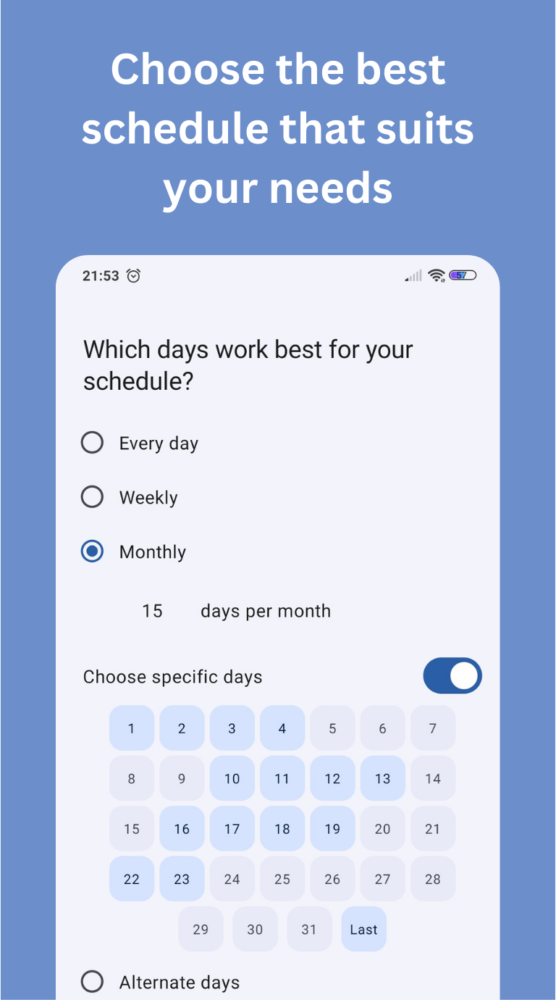
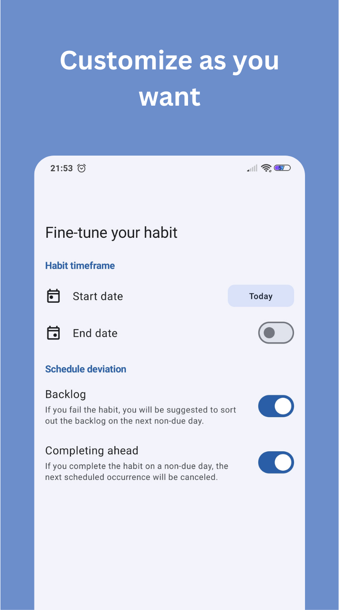

<h1 style="font-size:28px; line-height:1; text-align:center;"><b>Routine Tracker</b></h1>

  

 

  

 

 
 

|                                                         |                                                         |                                                      |
|---------------------------------------------------------|---------------------------------------------------------|------------------------------------------------------|
|  |  |  |

Routine Tracker is a planner that aims to simplify managing activities that you need to perform consistently. It combines features of a planner calendar app and a habit tracker allowing you to keep all your activities in one place.

The motivation for this project is simple. I couldn't find any planner or habit tracker that estimates how long it will take you to achieve a goal based on your progress. So I decided to build it myself. I aim to develop a universal solution for planning and tracking your projects as well as scheduling your daily tasks and events. 

## Features that are already available

- **Flexible schedules.** The app supports daily, weekly, monthly, and alternate-day schedules. You're free to choose specific days or inform the app how many times you wish to complete the task within a period.
- **Adaptive schedule that changes automatically based on your progress.** When you fail to complete your routine, you’ll be suggested to sort out the backlog on the next non-due day. And vice versa, when you over-complete your routine, the next scheduled occurrence will be canceled. This behavior can be altered in the settings.
- **Adequate streaks.** Streaks do not only form out of multiple completions in a row. Non-due days are included in the streak as well. Your streak will remain unbroken as long as you complete the habit the planned number of times within a given period.
- **Plan ahead.** The routine calendar displays completions, streaks, and planning dates to help you visualize your progress and plan your future time effectively. View a clean and organized agenda for any date, eliminating visual clutter.
- **Modern UI.** Enjoy a visually appealing and modern interface, following the principles of the Material You design. The application supports both light and dark modes, landscape orientation, and dynamic color on Android versions 12 and later.
- **Completely free app with no limitations.** Track as many habits as you wish. Routine Tracker is entirely free and contains no ads or in-app purchases.
- **Works offline and respects your privacy.** Routine Tracker operates independently without needing an internet connection or online account registration. Your confidential data always remains on your device. Neither the developers nor any third parties can access your information.

## Features that will be implemented soon

- [ ]  edit routine and routine description
- [ ]  completion time and reminders
- [ ]  reordering the routines in a draggable list
- [ ]  skip days and put your routines on vacation
- [ ]  simple tasks
- [ ]  measurable routine

## Features that will be implemented in the long term

- [ ]  Automatic completion date estimation
- [ ]  Routine by a list of tasks that repeats on every period. E.g. upper body workout, ab workout, and leg workout → repeats every week.
- [ ]  Routine by a comprehensive list of tasks that are necessary for achieving your goal.

## Get the app

You can install the app from the [GitHub releases](https://github.com/DanielRendox/RoutineTracker/releases) page or build it yourself by [cloning the project](https://docs.github.com/articles/cloning-a-repository) and launching it in the latest version of [Android Studio](https://developer.android.com/studio).

## What do you think?

You're welcome to share your thoughts, suggest features, and ask questions in [GitHub discussions](http://github.com/DanielRendox/RoutineTracker/discussions)!

## Tech stack

The app is built with modern Android technologies and is designed to follow the best practices.

It utilizes:

- Jetpack Compose for the user interface, with a single Activity and no Fragments
- Official Compose navigation library
- View model for business logic separation
- SQLDelight database for local data storage
- Kotlin coroutines and flow for asynchronous requests
- Koin for dependency injection
- JUnit 5 for unit testing
- [kotlinx-datetime](https://github.com/Kotlin/kotlinx-datetime) for working with dates
- A super convenient [Calendar](https://github.com/kizitonwose/Calendar) library for Android. (shoutout to [@kizitonwose](https://github.com/kizitonwose))

The app follows:

- MVVM pattern
- CLEAN architecture with both repository and use cases
- SOLID principles
- multi-module architecture as suggested in the [NowInAndroid modularization learning journey](https://github.com/android/nowinandroid/blob/main/docs/ModularizationLearningJourney.md). It involves convention plugins and version catalogs for managing dependencies across modules.

_I embrace the possibility of utilizing Kotlin Multiplatform for porting the app to other platforms in the future, so SQLDelight, Koin, and Kotlinx-datetime are used instead of traditional Android libraries such as Hilt, Room, and java.time._

## Branching strategy
The project's branching strategy is simple. All the development work takes place in the `develop` branch whereas the `main` branch contains the code that is used in production. `feature` branches must be first merged into `develop`. Once the new features are implemented and tested, they are finally merged into `main` followed by the release of a new version of the app. When contributing to the project, please submit your pull requests to the `develop` branch.

## Documentation
For more information about [how Routine Tracker works](https://github.com/DanielRendox/RoutineTracker/blob/develop/docs/HowDoesRoutineTrackerWork.md) internally, navigate to the [docs folder](https://github.com/DanielRendox/RoutineTracker/tree/develop/docs). You can also use AI tools like [phorm.ai](https://www.phorm.ai/) to ask questions about the entire repo. Make sure the develop branch is checked out because it contains the most up-to-date content.

## Let’s work together!

The app currently stands at the MVP stage. Without your help, I won't be able to implement all the planned features. So, if you're inclined to offer support in any of the following areas:

- Development for the Android version,
- Porting to iOS or web platforms,
- Design enhancements,
- Translation to different languages,
- Promotion, and spreading the word about the app
- Identifying and reporting bugs,
- Or any other contributions you might have in mind,

and are willing to do so **voluntarily**, please don't hesitate to open an issue, submit a PR, or reach out to [me](https://github.com/DanielRendox) directly.

Whether you're a seasoned developer or just looking to hone your skills, your contributions are much appreciated.

Please note, as per the [GitHub Terms of Service](https://help.github.com/articles/github-terms-of-service/#6-contributions-under-repository-license), any code contributions will be licensed under the GPL v3, as it is the license of the original project.

## License

The project is licensed under the GPL, which means that you can freely build on top of it for commercial and non-commercial purposes alike. But should you choose to incorporate its code, you must open-source your project and apply the GPL license to it as well. Check out the [LICENSE](https://github.com/DanielRendox/RoutineTracker/blob/main/LICENSE) file for more details.
