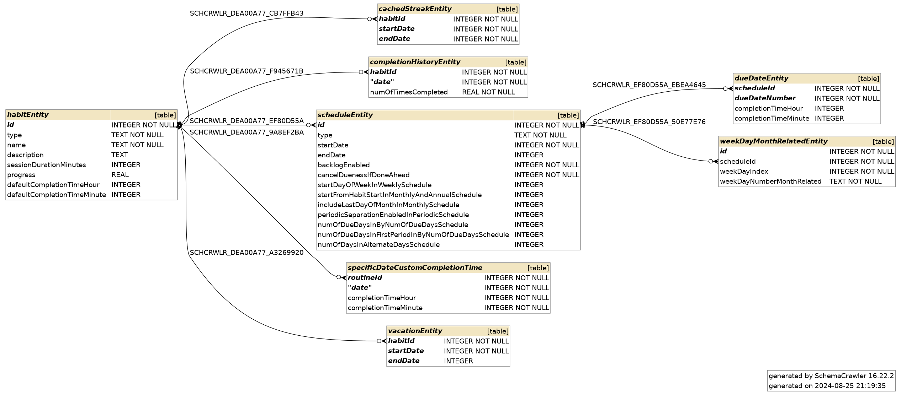

# Database schema

## habitEntity

`habitEntity` stores the habit and it’s properties. 

## scheduleEntity

Each habit must have at least one schedule, although we may later need to allow habits to have multiple schedules for different periods of time. 

`scheduleEntity` table can accommodate many types of schedules available in the program. This is achieved through **[Single Table Inheritance](https://stackoverflow.com/a/3579462/22295134)** where subtype-specific attributes are given a `NULL` value on rows where these attributes do not apply.

## dueDateEntity

Some types of schedules have due dates defined in this table. E.g. for the `WeeklySchedule` these are days of week, for `MonthlySchedule`, days of month, for `CustomDateSchedule` - dates. 

All values are serialized to `INTEGER`s which get deserealized to respective types of values based on the type of schedule. E.g. days of week are stored as numbers where monday is first, sunday is the seventh, dates are stored as numbers as well as the number after the epoch (`1970-01-01`).

There is also functionality that allows users to change the time of activities for separate dates. For example users may want to complete a habit at 5 PM on Monday, but on Wednesday they’d want to completed it on 7 PM. That’s why `dueDateEntity` also stores `completionTimeHour` and `completionTimeMinute` attributes. However, this functionality is not yet available in the release.

## weekDayMonthRelatedEntity

This is an entity for `MonthlySchedule` that allows users to define dates of recurring activities by specifying the number of day of week in the month. This can be useful for creating events that happen e.g. on the second Thursday of November.

## completionHistoryEntity

This is where habit completions are stored. We store the date of the completion and how many times the habit was completed. If the habit is of Yes/No type, it is either 0 or 1, but we also plan to introduce measurable habits in the future. There can be no more than one completion entry for the same date and the same habit.

## cachedStreakEntity

This is where cached habit streaks are stored. Whenever the program computes habit streaks, it caches them in this entity for future retrievals to improve performance. A streak is nothing more than a period with a start date and an end date.

## vacationEntity

`vacationEntity` is very similar to `cachedStreakEntity` but is used for storing habit vacations. A vacation can be just a skipped date, in this case startDate and endDate will be the same or several dates on which the habit is paused and not displayed as due.

## specificDateCustomCompletionTime

There is a functionality that allows users to set a different completion time for activities on separate dates. This is where this completion time is stored. However, this functionality is not yet available in the release.