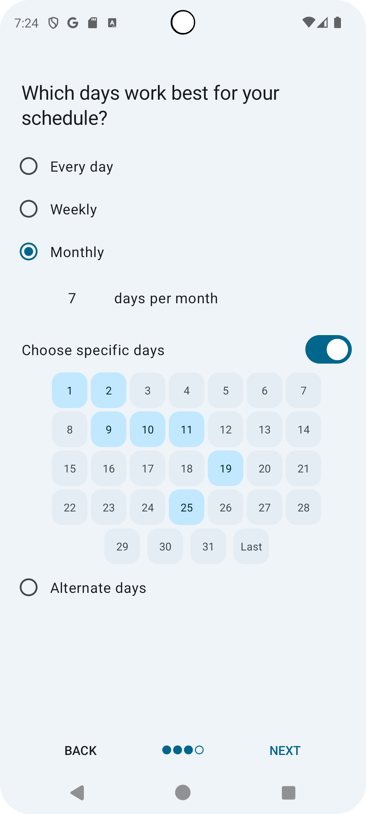
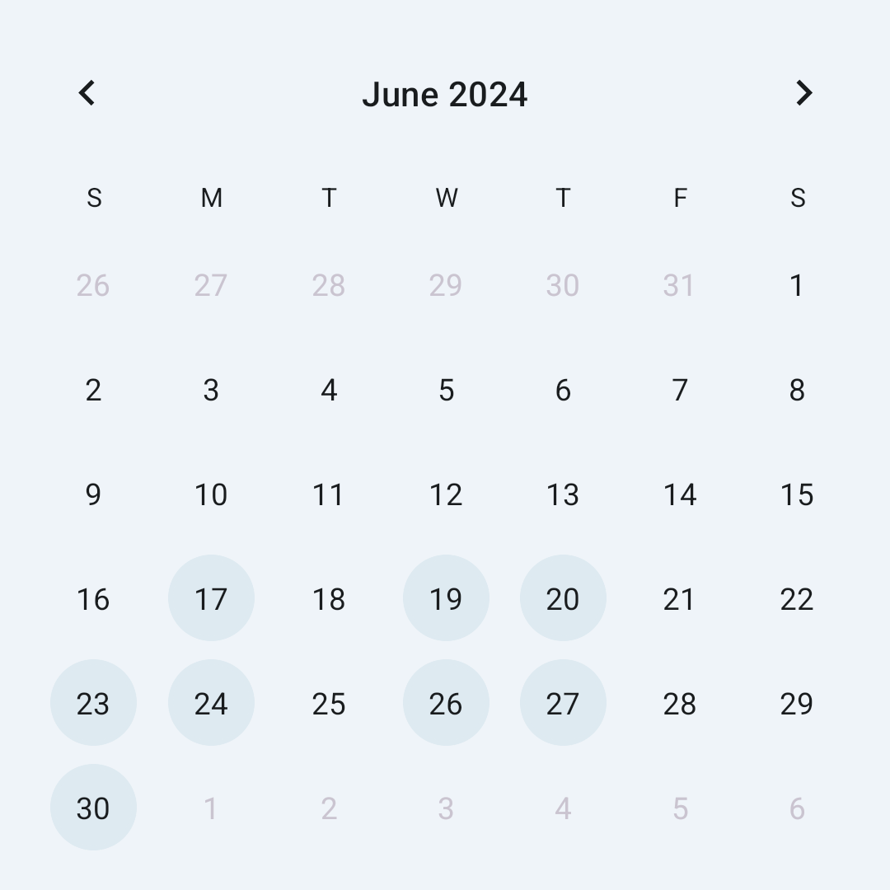
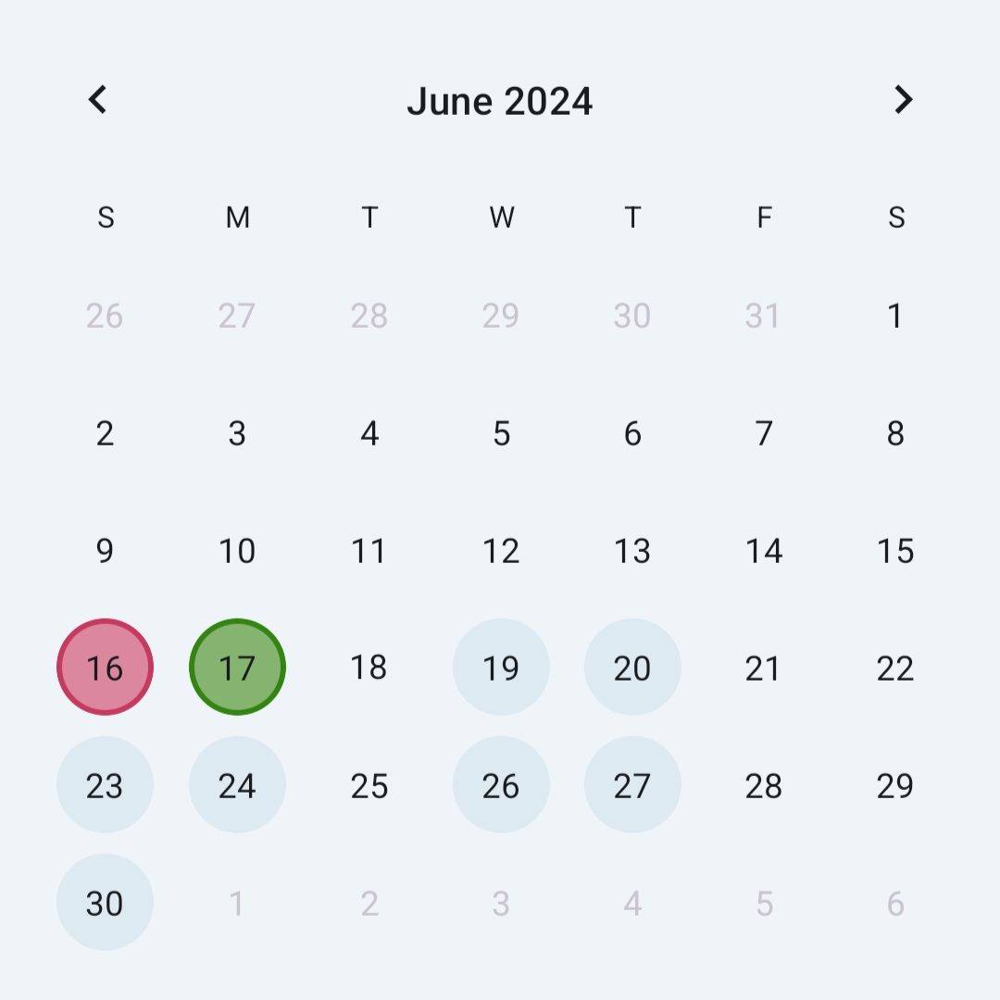
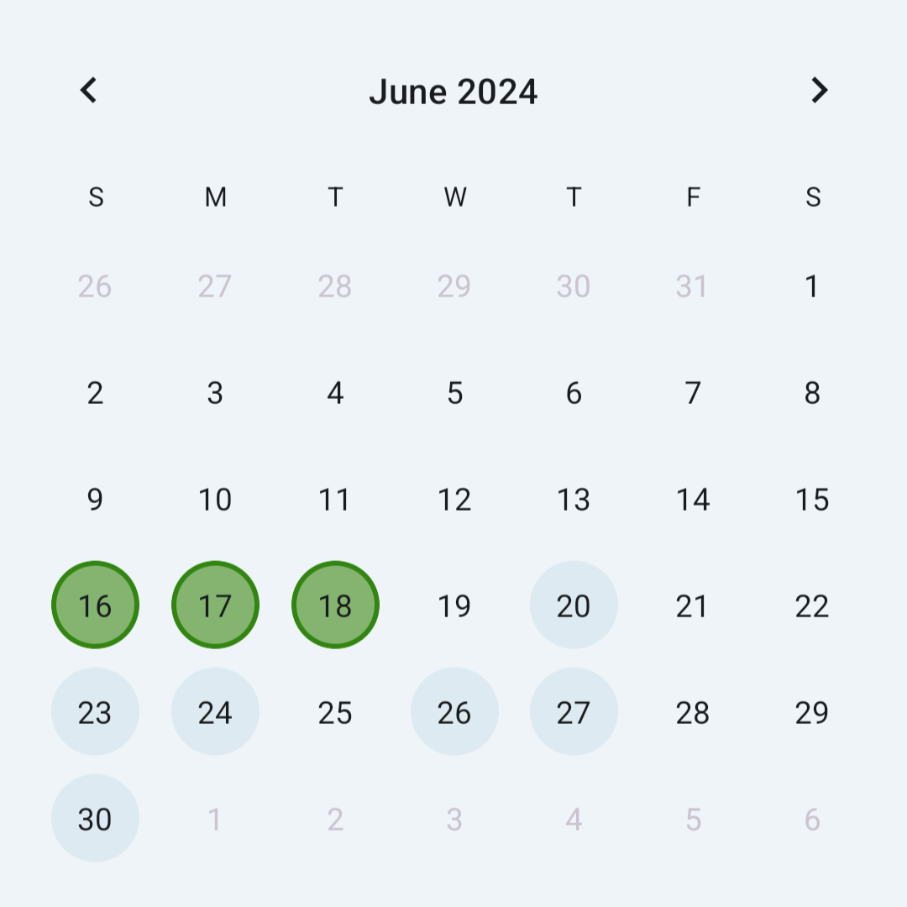
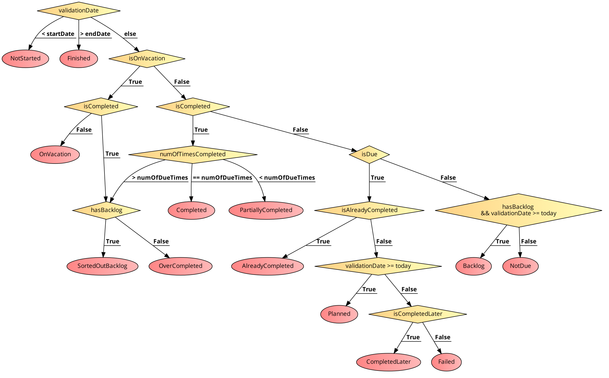
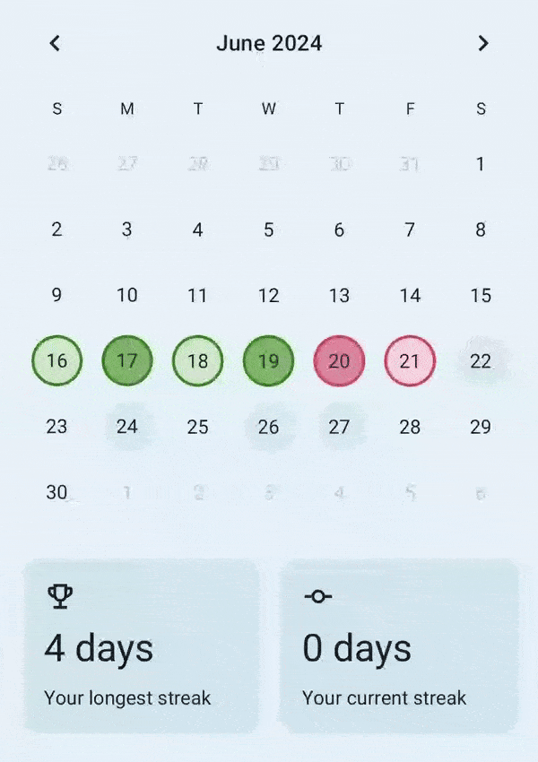
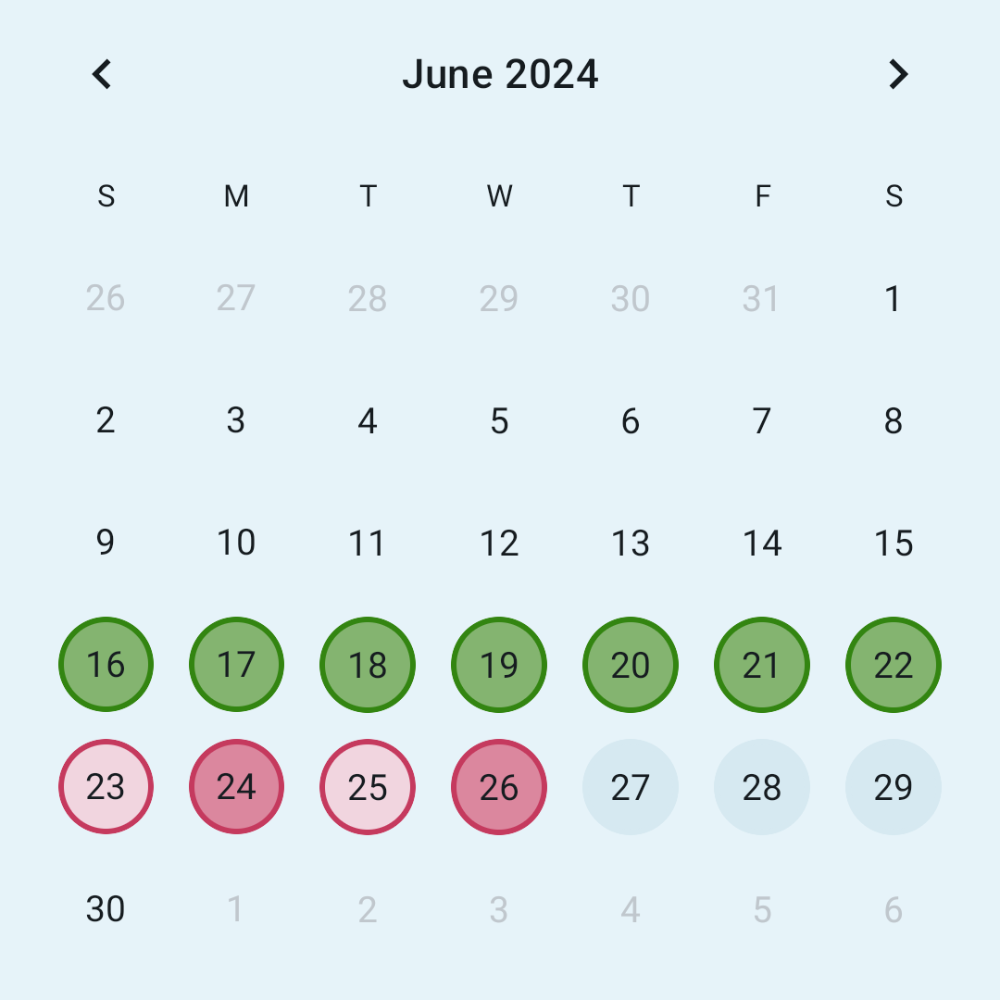

# How Does Routine Tracker Work?

- Most habit-tracking apps do not display days on which a certain habit is planned.
- Most calendar apps that support repeating tasks do not show streaks and statistics.
- Many to-do apps do not support repeating tasks. And those that do, don’t display tasks as backlog if they haven’t been completed in time and don’t cancel the next occurrence if they’ve been completed ahead.

Routine Tracker provides all those missing features. However, this requires a rather complex algorithm. So let’s see how it works.

This doc will explain how this algorithm is built and why it is not built differently in the form of a tutorial. We’ll first understand our requirements and then figure out the implementation step by step.

## Repeating tasks

In the end, habits are tasks repeated according to a certain schedule. Routine Tracker provides the following schedules in [`Schedule.kt`](https://github.com/DanielRendox/RoutineTracker/blob/develop/core/model/src/main/java/com/rendox/routinetracker/core/model/Schedule.kt):

1. **Daily Schedule**: The habit will be repeated every day.
2. **Weekly Schedule**:
    - Users can select specific days of the week.
    - Alternatively, users can enter a number of days (e.g., 4 days per week). If no specific days are selected, the habit will be due on the first four days of the week.
3. **Monthly Schedule**:
    - Users can select specific days of the month or the last day of the month (to account for months with varying numbers of days).
    - Alternatively, users can enter a number of days (e.g., 10 days per month). If no specific days are selected, the habit will be due on the first ten days of the month.
    - Users can define dates using patterns such as the 2nd Monday of the month or the 4th Saturday of the month.
4. **Alternate Days Schedule**: Users can specify a custom period (e.g., work for 3 days, then rest for 2 days, and repeat).
5. **Annual Schedule**: This works similarly to weekly and monthly schedules but spans a year.
6. **Custom Date Schedule**: Users can select specific days that do not repeat.

  

Implementing this "calendar" functionality is pretty straightforward. We use `kotilnx-datetime` (KMM alternative for `java.time`) library to figure out what day of month or week a certain date is. In the case of the Alternate Days Schedule, we count how many days have passed since the start date, and then use `%` operator to determine if the date is due or not. Check [`ScheduleIsDue.kt`](https://github.com/DanielRendox/RoutineTracker/blob/develop/core/domain/src/main/java/com/rendox/routinetracker/core/domain/completion_history/ScheduleIsDue.kt) file for more details.

Great! Now it shows us on what dates the habit is due. For example, here is what we’ve got for a Sun-Mon-Wen-Thu habit (only dates after the start date are displayed as due):

### Save completions

Users should be able to click on dates to mark or unmark them as completed. So when a date is marked as completed, we will save this date to a completion history table of our SQLite database. If the user clicks on the same date again, we'll delete it from the database.

|                                       |                                             |
|---------------------------------------|---------------------------------------------|
|  |  | 

## Make it adaptive

As you can see, the user planned to complete tasks on four days within a week, but they missed Sunday. We want to inform the user that they have a backlog so that they can catch up on the next available day. This means that Tuesday should be displayed as due. If the user misses Tuesday, we will continue displaying the backlog on Friday, and so on until the end of the period.

We aim to achieve similar functionality for completing tasks ahead of schedule. If we now mark Sunday and Monday as completed, the backlog should disappear. Additionally, if we mark Tuesday as completed, Wednesday should not be due anymore. This is because the habit was not planned for Tuesday, and we have already exceeded the required tasks for that day. Therefore, we can be free on Wednesday, having completed the planned work for the period from Sunday to Wednesday.

  

This is called Adaptive Scheduling.

However, the actual implementation of this is not easy, as there are always tricky cases. To achieve this behavior in a simplified form, we need to loop through a certain number of previous or, in some cases, future dates to determine how many were completed and how many should have been completed. From this, we can derive a number called Schedule Deviation.

This number represents how much the user deviates from the schedule. For example, a value of -5 indicates a backlog of 5 days, a value of 3 indicates that they have over-completed tasks for 3 future days, and a value of 0 indicates that the user neither has a backlog nor has completed anything ahead of schedule.

After determining this number, we can finally derive the habit status on a particular date. All statuses are defined in [`HabitStatus.kt`](https://github.com/DanielRendox/RoutineTracker/blob/develop/core/model/src/main/java/com/rendox/routinetracker/core/model/HabitStatus.kt) Each status has a comment that describes what it means, so feel free to check it out.

The following scheme shows the algorithm for deriving these statuses:

This algorithm is designed to support different types of habits, which we plan to introduce in the future. What matters is how many times the habit is completed. It doesn't matter how these completions are defined—whether it’s a simple yes or no, a numeric value, or a list of subtasks.

> [!IMPORTANT]  
> As you can see, different dates are dependent on one another. Therefore, to compute the habit status for a certain date, we need to obtain the completion history and vacation history of the entire period.

There is also a Vacations feature that allows users to skip days and pause a habit for a certain period. If a habit is on vacation, missing a due date will not break the habit’s streak, and missed dates will not be displayed as failed.

## The data flow

So the data flow works as follows. When a habit is created, it gets saved to the database with all its properties. When the user marks certain days as completed, these days are added to a separate SQLite table along with the number of times completed.

We have a function that computes habit statuses on a certain date. This function requires the habit and its history to be passed as a parameter. The size of this history matters. If this list is too small and doesn't cover the entire period, the computed statuses may be incorrect.

We have logic for deriving these periods inside [`ScheduleGetPeriodRange.kt`](https://github.com/DanielRendox/RoutineTracker/blob/develop/core/domain/src/main/java/com/rendox/routinetracker/core/domain/completion_history/ScheduleGetPeriodRange.kt) For example, if the habit has a Weekly schedule it will return the corresponding week the validation date is in, if Monthly - month, and so on. It also accounts for possible edge cases, e.g. when the habit’s start date is not the period start date.

So when we need to compute statuses for all dates within a certain period (e.g. for a single month on the Calendar screen), we first expand this period to ensure no important data is missed. Then we get the habit, its completion history, and vacation history from the database. And finally, we compute statuses for those dates.

All of this is done in the domain layer of the CLEAN architecture. The call chain starts from the [`GetHabitCompletionDataUseCase`](https://github.com/DanielRendox/RoutineTracker/blob/develop/core/domain/src/main/java/com/rendox/routinetracker/core/domain/completion_history/GetHabitCompletionDataUseCase.kt), which is then exposed to the UI layer.

## Streaks

In many habit-tracking apps, streaks are formed from multiple consecutive completions. This strategy works well for everyday schedules. However, it doesn't work as effectively for other types of schedules. In these cases, habit-tracking apps include the entire period in the streak only when all planned dates in the period are completed. For example, if we had a habit with a Mon-Wed-Thu schedule, the entire week would be included in a streak only when all three days were completed.

While this is relatively easy to implement, there is a problem: the streak will be broken on Tuesday even though the habit is not due on that date.

Routine Tracker’s design presumes that completed days are marked with a dark green color and failed days with a dark red color. Not due days can be either light red or light green. The light red color indicates that the user is falling behind the schedule they set for themselves, while the light green color indicates that the user does not have any backlog or is even ahead of the schedule.

  

That’s why Routine Tracker computes streaks differently than other habit-tracking apps.

- A streak starts either
    - on the completed day,
    - on the start day of the period (if there are no failed dates between the start and the next completed day),
    - or after a failed date.
- Streaks get broken on the first failed date.

This allows us to achieve the following behavior:

- If we mark the 22nd of June as completed, the backlog gets sorted out and the streak continues.
- If we mark the 18th of June as completed, the habit gets completed ahead of schedule, and therefore, Thursday is not considered Failed anymore.
- If we uncomplete the habit on the 17th of June, the streak gets broken on Monday, but Tuesday stays included in the streak because the habit is completed on Wednesday.

See the demo above. Or you can install the app and play around with it yourself.

---

But how is this functionality actually implemented? Well, there seems to be no better solution than computing habit statuses for each day in the period, looping through them, and forming the list of streaks in this way.

As you can see, we also need to show statistics for the longest and current streak. For that, we need to know all the streaks of the habit. However, computing habit statuses for the entire history of the habit from its start date until today is not performant, as there can be habits that started many years ago.

That’s why we cache these streaks in the database. Whenever a streak gets computed for the first time it gets inserted in the cached streaks table. To ensure that the cached data stays up to date, we recompute it whenever the user makes a change. This is more performant because only the respective period is recomputed each time rather than the entire history. We cache streaks for every period except for the current one (the period that contains today). That’s because the current period is prone to frequent changes.

Check out the respective implementation of the [`StreakComputer`](https://github.com/DanielRendox/RoutineTracker/blob/develop/core/domain/src/main/java/com/rendox/routinetracker/core/domain/streak/StreakComputer.kt) interface to find out how streaks are computed.

It would be easier if all those habit statuses were saved in the database, but this would lead to many other problems because we’d need to update an unknown number of dates with each completion.

> [!TIP]
> This is also why each period of the habit is made to be independent of one another. If they were all related, it would be bad for performance as it would require fetching the entire habit history and operating on it. The core logic inside `HabitStatusComputer` does support related periods, but they are configured to be independent throughout the app.

To give you a better understanding of what independent periods means, if you try clicking on all dates from the previous Week in our Sun-Mon-Wen-Thu Habit, making it over-completed by 3 days, next week’s scheduled occurrences will not be canceled anyway because these two periods are **independent**.

  

## A couple of nuances

1. **You may have noticed that not all of the schedules from [`Schedule.kt`](https://github.com/DanielRendox/RoutineTracker/blob/develop/core/model/src/main/java/com/rendox/routinetracker/core/model/Schedule.kt) are available when creating a habit.** This is primarily due to performance considerations, but aside from that, these schedules are not really suitable for habits. With the current design of the app, it doesn't make sense to display streaks, such as for an annual schedule. However, these schedules will later be used for tasks and events, which will be implemented as separate types of activities in the future.

2. **Routine Tracker restricts completing activities on future dates** to align with the app's underlying principles. Certain habit statuses can be displayed exclusively in the past or in the future. For example, future due days always have a `Planned` status; they can’t be marked as `Failed`. A due date acquires `Failed` status only when it becomes a past date. For example, if today is due, it will have `Planned` status all day long. And if it doesn't get completed, it will be changed to `Failed` but only on the next day.

## Limitations of this approach

The data that is loaded on screens is currently not dynamic because its pipeline is realized through suspending calls not through observable APIs such as Kotlin Flows or LiveData.

Migrating the app to observable APIs is not easy for several reasons. One of them is that to get habits that are due for a specific date like it is done in the Agenda screen, we need to:

1. Fetch a habit from the database.
2. Figure out what part of their history we need, based on their schedules. Again, we need to fetch the entire period because all dates within a period are dependent on one another.
3. Fetch the respective part of the completion history from the database.
4. Fetch the respective part of the vacation history from the database.
5. Compute the habit status on the given date.
6. Repeat for all other habits.

So there is no easy way to subscribe to the updates in the database directly. This is bad because, with this approach, we have to reload the data in the agenda screen every time the user navigates back from some other screen as the data may be outdated due to the changes made on that new screen.

Loading habits and their statuses is also happening with a certain delay. This operation is not fast as it requires several database calls. However, the logic of computing statuses works rather quickly. The problem is in not efficient fetch operations. So it would be great if we could optimize database calls or its structure to make these things work faster.

There is also custom paging realized for the Routine Calendar. When the user opens the details screen, the app preloads statuses for several months ahead to improve the UX for scrolling through months in the calendar. This could be an obstacle for migrating to observable APIs as well.

## Read next

And that's how Routine Tracker works. If you are interested to learn more about how the app is built internally, check out other docs:

- [Database schema](DatabaseSchema.md)
- [Module Structure](ModuleStructure.md)
- [Use Cases Use Cases (The domain layer of CLEAN architecture)](UseCasesDomainLayer.md)
- [Handling one-off events](HandlingOneOffEvents.md)
